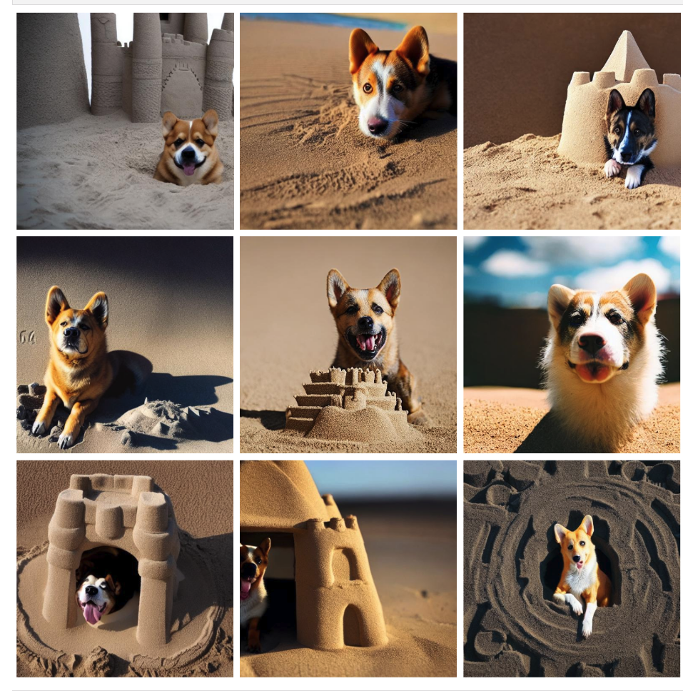

## Introduction

This example demostrate how to fine tune Stable Diffusion with DreamBooth and Ray Train using OpenShift AI.  

## Credits

The example codes are from:
1. [Ray dreambooth finetuning](https://docs.ray.io/en/latest/train/examples/pytorch/dreambooth_finetuning.html)
1. [Ray Train Stable Diffussion Notebook](https://github.com/GoogleCloudPlatform/ai-on-gke/blob/main/ray-on-gke/examples/notebooks/raytrain-stablediffusion.ipynb)

## Overview 

In this example, a workbench will be automatically created in this example with a few notebooks to explore Ray.

| Name | Description |
| -------------------- | ----------- |
| [Introduction](../../notebook/00%20Intro.ipynb)   | A simple demostrate of ray remote function         |
| [Ray Train with Stable Diffusion](../../notebook/01%20raytrain-stablediffusion.ipynb) | Using Ray train to distibute training

## Prerequisite

* Ensure there is a RWX available storage class, such as `
ocs-storagecluster-cephfs`. The `stable-diffusion-shared-storage` pvc uses cephfs otherwise update the PVC resource. 

  You can install OpenShift Data Foundation to achieve this. The CSI plugin daemonset will have to be updated to tolerate the GPU taint. 

  ``` 
  oc apply -f yaml/operators/rook-ceph-operator-config.yaml
  ```

  ``` yaml
  data:
    CSI_PLUGIN_TOLERATIONS: |-
      - key: nvidia.com/gpu
        operator: Exists
        effect: NoSchedule
  ```

* Ensure other [prerequisites](../../) are already configured. 

## Setting Up the Demo

Run the makefile target. This creates a Data Science Project called `distributed` with the following
* A CephFS RWX PVC
* A single workbench with the git repository already cloned inside
* Kueue configurations

``` bash
make setup-ray-distributed-training
```

## Running the Examples

In the workbench, navigate to `/openshift-ai-ray/notebook` to begin exploring the notebooks.

### Fine-tune of Stable Diffusion with DreamBooth and Ray Train

The `01 raytrain-stablediffusion.ipynb` notebook provides various steps from the Ray docs [example](https://docs.ray.io/en/latest/train/examples/pytorch/dreambooth_finetuning.html#step-5-generate-images-of-the-subject) and will create a Ray cluster with 4 workers with 1 GPU each to run the jobs.

The Ray cluster is using a [yaml](../../notebook/raycluster.yaml) definition, instead of the CodeFlare SDK because of the current lack of [volume mount](https://github.com/project-codeflare/codeflare-sdk/pull/554) support in `ClusterConfiguration`.

Once a Ray cluster has been created, you can login with your user account to the dashboard to view the Ray job and Cluster details. The dashboard is integrated with OpenShift OAuth


Once the model hase been fine tuned, you can [generate](https://docs.ray.io/en/latest/train/examples/pytorch/dreambooth_finetuning.html#step-5-generate-images-of-the-subject) your images which is provided in the notebook.

``` bash
  python generate.py \
    --model_dir=$TUNED_MODEL_DIR \
    --output_dir=$IMAGES_NEW_DIR \
    --prompts="$YOUR_PROMPT" \
    --num_samples_per_prompt=9 \
    --use_ray_data
```    

The images will be shown using `matplotlib`.



### Uploading and serving the model using KServe 

* `02 raytrain-stablediffusion-upload-model.ipynb` uploads the tuned model to a local S3 bucket.
* `03 raytrain-stablediffusion-model-serving.ipynb` sets up KServe with PyTorch